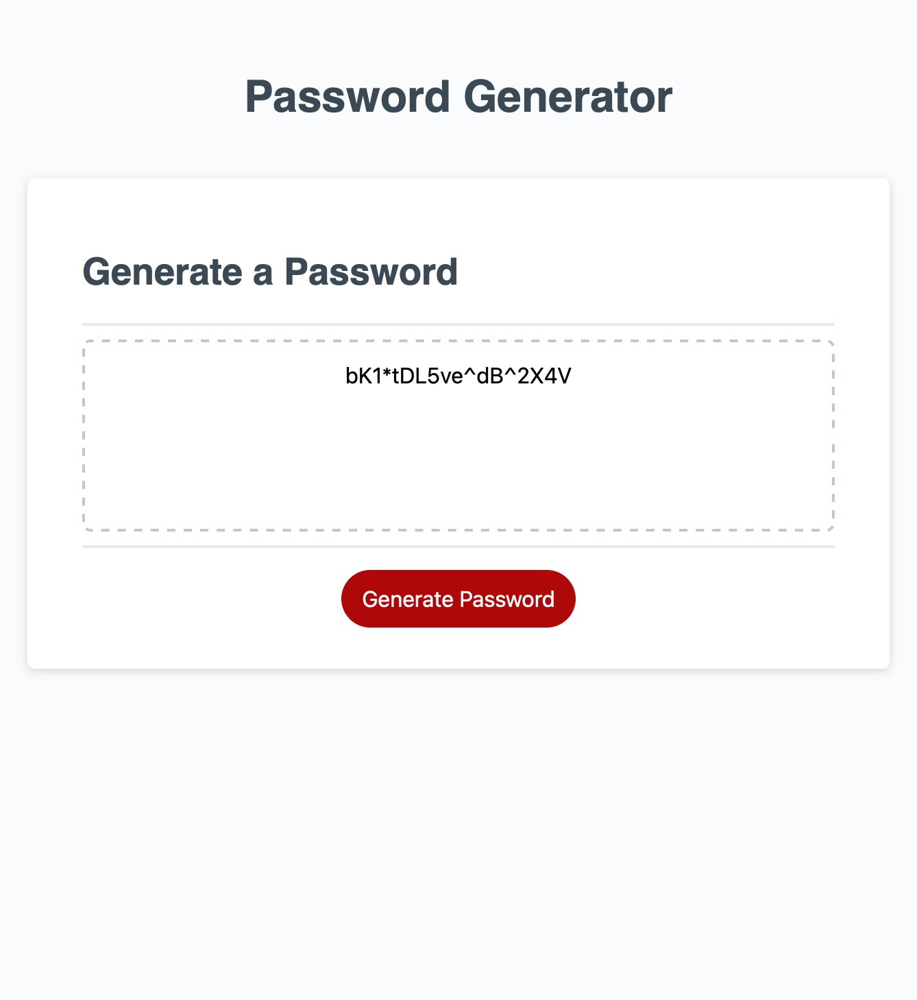

# 03-challenge-JavaScript# 03-challenge-JavaScript

## Description

PASSWORD GENERATOR

1.Length of the password between 8 to 128 characters.

2.Included lowercase letters.

3.Included uppercase letters.

4.Included include numeric characters.

5.Included special characters.

## Built With

* HTML
* CSS
* JS

Website

